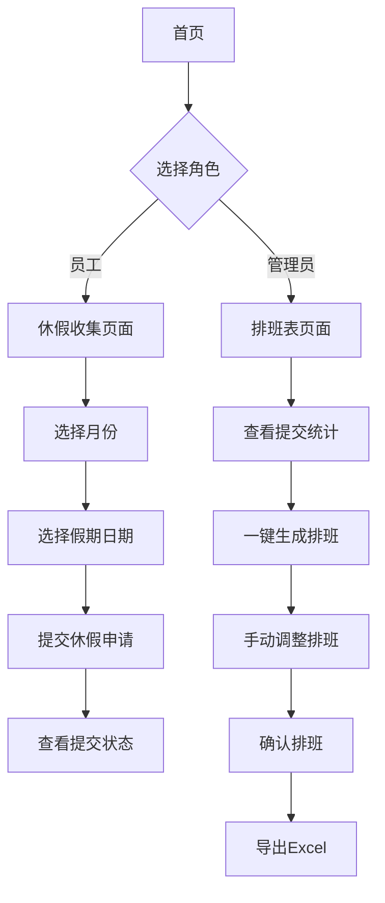

## 1. Product Overview
捷展云仓智能排班系统是一款面向仓库管理人员和员工的排班管理工具，旨在简化休假收集、智能排班、手动调整和数据导出等流程，提高仓库运营效率。
- 核心功能：休假收集、智能排班、手动调整、Excel导出
- 目标用户：仓库管理员、一线员工
- 市场价值：提升排班效率，减少人工错误，增强员工满意度

## 2. Core Features

### 2.1 User Roles
| Role | Registration Method | Core Permissions |
|------|---------------------|------------------|
| 管理员 | 预设账号 | 管理员工、查看所有排班、一键生成排班、确认排班、导出数据 |
| 员工 | 预设账号 | 选择指定休、申请请假、查看个人排班 |

### 2.2 Feature Module
1. **首页**: 快速导航、系统概览、待办事项
2. **休假收集页面**: 员工选择、月份选择、日历选择、假期类型、提交统计
3. **排班表页面**: 智能排班生成、手动调整、排班确认、Excel导出
4. **员工管理页面**: 员工列表、新增员工、编辑员工信息

### 2.3 Page Details
| Page Name | Module Name | Feature description |
|-----------|-------------|---------------------|
| 首页 | 导航入口 | 快捷跳转到休假收集和排班生成页面 |
| 首页 | 系统概览 | 显示当月应休天数、已提交人数、未提交人数 |
| 首页 | 待办事项 | 显示需要处理的排班任务 |
| 休假收集 | 员工选择 | 下拉选择员工，支持切换身份 |
| 休假收集 | 月份选择 | 选择目标月份 |
| 休假收集 | 日历组件 | 可视化日历，支持多种假期类型选择 |
| 休假收集 | 假期类型 | 指定休、调休、请假、年假、婚假、产检、产假 |
| 休假收集 | 提交统计 | 显示已提交和未提交人数 |
| 休假收集 | 提交详情 | 显示所有员工提交状态 |
| 排班表 | 月份选择 | 选择排班月份 |
| 排班表 | 一键生成 | 根据休假收集数据自动生成排班表 |
| 排班表 | 手动调整 | 拖拽调整员工班次 |
| 排班表 | 确认排班 | 确认并锁定排班表 |
| 排班表 | 导出Excel | 将排班表导出为Excel文件 |
| 员工管理 | 员工列表 | 显示所有员工信息 |
| 员工管理 | 新增员工 | 添加新员工 |
| 员工管理 | 编辑员工 | 修改员工信息 |

## 3. Core Process

### 用户流程：
1. **员工提交休假**: 登录 → 选择月份 → 在日历上选择假期 → 提交
2. **管理员生成排班**: 查看提交统计 → 一键生成排班 → 手动调整 → 确认排班 → 导出Excel

## 4. User Interface Design

### 4.1 Design Style
- **主色调**: 深蓝色 (#1e3a5f) 作为主色，搭配浅蓝色 (#4a90d9) 作为辅助色
- **按钮样式**: 圆角矩形，hover效果带有阴影变化
- **字体**: 标题使用 "Inter" 粗体，正文使用 "Inter" 常规
- **布局风格**: 卡片式布局，清晰的视觉层次
- **图标风格**: 使用 Lucide 图标库，简洁现代

### 4.2 Page Design Overview
| Page Name | Module Name | UI Elements |
|-----------|-------------|-------------|
| 首页 | 导航入口 | 两大功能卡片，带有图标和描述，hover时有缩放效果 |
| 首页 | 系统概览 | 统计卡片，显示关键指标，带有数字动画 |
| 休假收集 | 日历组件 | 月视图日历，不同假期类型用不同颜色标记 |
| 休假收集 | 假期类型 | 标签式选择器，点击切换选中状态 |
| 休假收集 | 提交统计 | 进度条展示，清晰的数字对比 |
| 排班表 | 排班表格 | 交互式表格，支持拖拽操作 |
| 排班表 | 操作按钮 | 工具栏布局，按钮分组清晰 |

### 4.3 Responsiveness
- **桌面端**: 完整功能展示，多列布局
- **平板端**: 自适应布局，保持核心功能
- **移动端**: 单列布局，优化触摸交互

### 4.4 交互细节
- 日历选择时带有选中动画
- 按钮点击有反馈效果
- 数据加载时有loading动画
- 提交成功时有成功提示