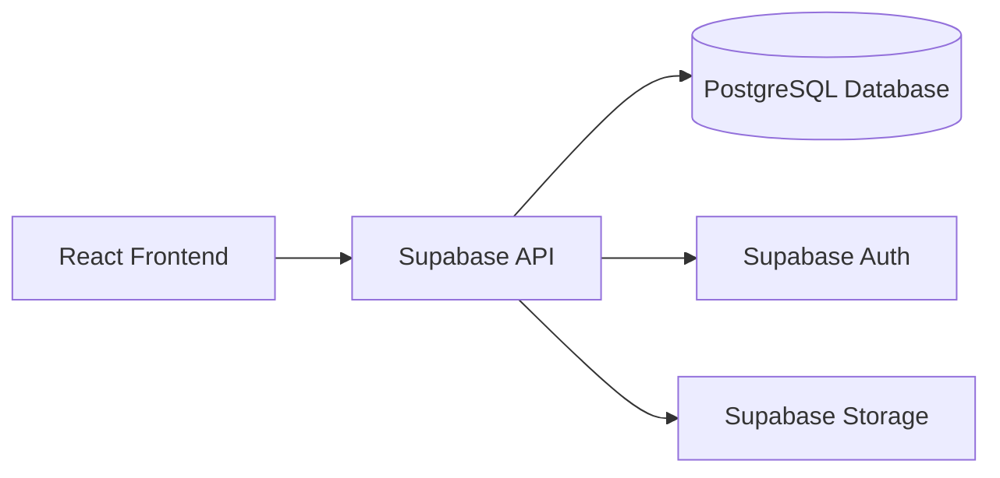
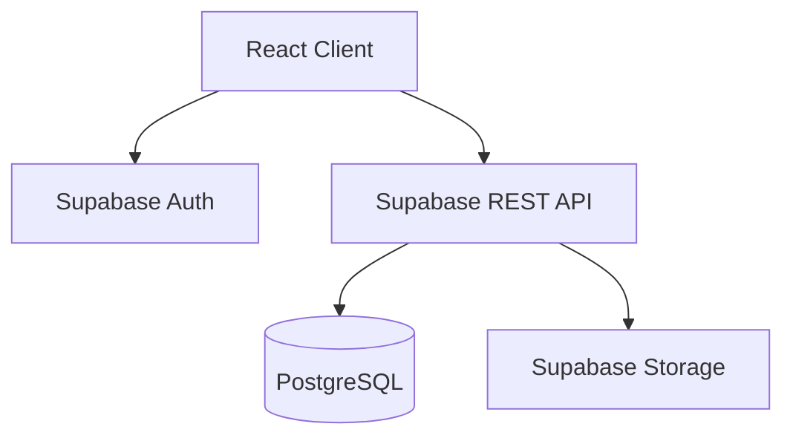
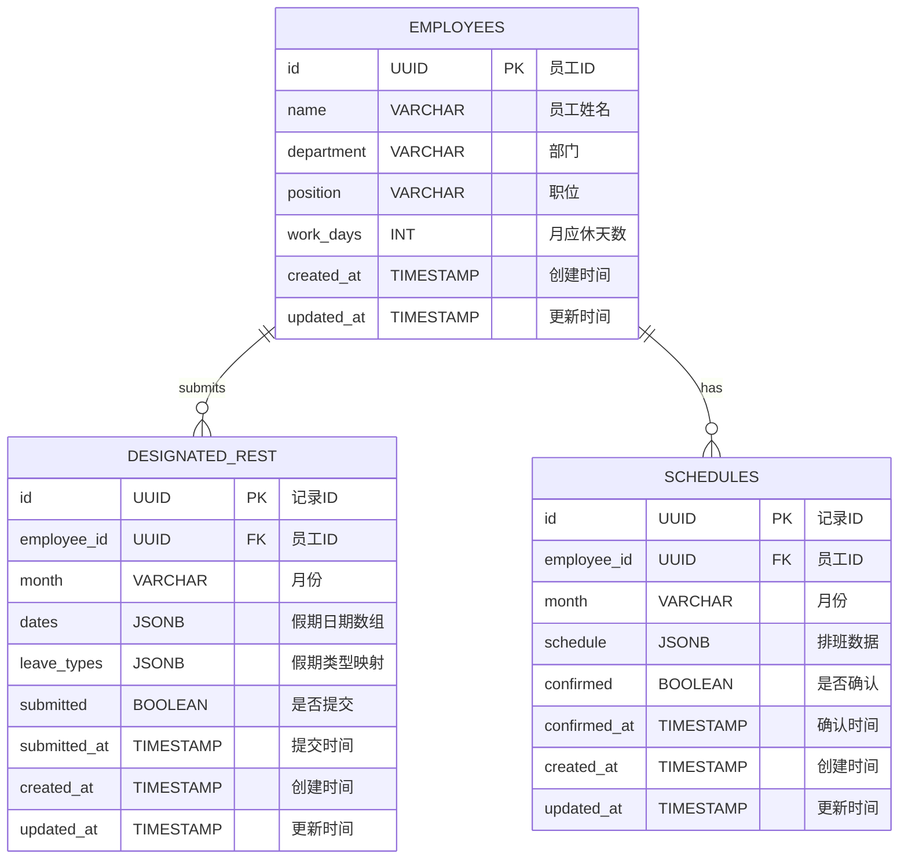

## 1. Architecture Design



## 2. Technology Description
- **Frontend**: React@18 + TypeScript + TailwindCSS@3 + Vite
- **Initialization Tool**: vite-init
- **Backend**: Supabase (Auth, Database, Storage)
- **State Management**: Zustand
- **Routing**: React Router DOM
- **Icons**: Lucide React
- **Excel Export**: SheetJS (xlsx)

## 3. Route Definitions
| Route | Purpose |
|-------|---------|
| / | 首页，系统概览和导航 |
| /leave | 休假收集页面 |
| /schedule | 排班表生成页面 |
| /employees | 员工管理页面 |

## 4. API Definitions (Supabase Client)

### 4.1 Employees
- **GET**: `supabase.from('employees').select('*')` - 获取员工列表
- **POST**: `supabase.from('employees').insert([...])` - 新增员工
- **UPDATE**: `supabase.from('employees').update({...}).eq('id', id)` - 更新员工
- **DELETE**: `supabase.from('employees').delete().eq('id', id)` - 删除员工

### 4.2 DesignatedRest
- **GET**: `supabase.from('designated_rest').select('*').eq('month', month)` - 获取指定休数据
- **POST**: `supabase.from('designated_rest').insert([...])` - 提交指定休
- **UPDATE**: `supabase.from('designated_rest').update({...}).eq('id', id)` - 更新指定休

### 4.3 Schedules
- **GET**: `supabase.from('schedules').select('*').eq('month', month)` - 获取排班数据
- **POST**: `supabase.from('schedules').insert([...])` - 保存排班
- **UPDATE**: `supabase.from('schedules').update({...}).eq('id', id)` - 更新排班

## 5. Server Architecture Diagram (Supabase)



## 6. Data Model

### 6.1 Data Model Definition



### 6.2 Data Definition Language

```sql
-- 员工表
CREATE TABLE employees (
    id UUID PRIMARY KEY DEFAULT gen_random_uuid(),
    name VARCHAR(50) NOT NULL,
    department VARCHAR(50),
    position VARCHAR(50),
    work_days INT DEFAULT 4,
    created_at TIMESTAMP DEFAULT NOW(),
    updated_at TIMESTAMP DEFAULT NOW()
);

-- 指定休表
CREATE TABLE designated_rest (
    id UUID PRIMARY KEY DEFAULT gen_random_uuid(),
    employee_id UUID REFERENCES employees(id),
    month VARCHAR(7) NOT NULL,
    dates JSONB DEFAULT '[]'::jsonb,
    leave_types JSONB DEFAULT '{}'::jsonb,
    submitted BOOLEAN DEFAULT FALSE,
    submitted_at TIMESTAMP,
    created_at TIMESTAMP DEFAULT NOW(),
    updated_at TIMESTAMP DEFAULT NOW()
);

-- 排班表
CREATE TABLE schedules (
    id UUID PRIMARY KEY DEFAULT gen_random_uuid(),
    employee_id UUID REFERENCES employees(id),
    month VARCHAR(7) NOT NULL,
    schedule JSONB DEFAULT '{}'::jsonb,
    confirmed BOOLEAN DEFAULT FALSE,
    confirmed_at TIMESTAMP,
    created_at TIMESTAMP DEFAULT NOW(),
    updated_at TIMESTAMP DEFAULT NOW()
);

-- 创建索引
CREATE INDEX idx_designated_rest_month ON designated_rest(month);
CREATE INDEX idx_schedules_month ON schedules(month);

-- 初始数据
INSERT INTO employees (name, department, position, work_days) VALUES
('谢焕君', '仓储部', '操作员', 4),
('陈文童', '仓储部', '操作员', 4),
('付新远', '仓储部', '操作员', 4),
('林创武', '仓储部', '操作员', 4),
('李亚景', '仓储部', '操作员', 4),
('迟喻阳', '仓储部', '操作员', 4),
('蒋能', '仓储部', '操作员', 4),
('林镇兴', '仓储部', '操作员', 4),
('林佗贵', '仓储部', '操作员', 4),
('吴兴义', '仓储部', '操作员', 4),
('吴兴浪', '仓储部', '操作员', 4),
('刘少东', '仓储部', '操作员', 4),
('陈安然', '仓储部', '操作员', 4),
('黄丽情', '仓储部', '操作员', 4),
('崔斯欣', '仓储部', '操作员', 4);
```

## 7. Supabase RLS Policies

```sql
-- 员工表：允许匿名用户读取，认证用户可读写
CREATE POLICY "Allow anonymous read on employees" ON employees
    FOR SELECT USING (true);

CREATE POLICY "Allow authenticated write on employees" ON employees
    FOR INSERT WITH CHECK (auth.role() = 'authenticated');

CREATE POLICY "Allow authenticated update on employees" ON employees
    FOR UPDATE WITH CHECK (auth.role() = 'authenticated');

CREATE POLICY "Allow authenticated delete on employees" ON employees
    FOR DELETE USING (auth.role() = 'authenticated');

-- 指定休表：允许匿名用户读取，认证用户可读写
CREATE POLICY "Allow anonymous read on designated_rest" ON designated_rest
    FOR SELECT USING (true);

CREATE POLICY "Allow authenticated write on designated_rest" ON designated_rest
    FOR INSERT WITH CHECK (auth.role() = 'authenticated');

CREATE POLICY "Allow authenticated update on designated_rest" ON designated_rest
    FOR UPDATE WITH CHECK (auth.role() = 'authenticated');

-- 排班表：允许匿名用户读取，认证用户可读写
CREATE POLICY "Allow anonymous read on schedules" ON schedules
    FOR SELECT USING (true);

CREATE POLICY "Allow authenticated write on schedules" ON schedules
    FOR INSERT WITH CHECK (auth.role() = 'authenticated');

CREATE POLICY "Allow authenticated update on schedules" ON schedules
    FOR UPDATE WITH CHECK (auth.role() = 'authenticated');
```

## 8. Project Structure

```
src/
├── components/          # 组件
│   ├── Layout/         # 布局组件
│   ├── Calendar/       # 日历组件
│   ├── Schedule/       # 排班组件
│   └── UI/             # 通用UI组件
├── pages/              # 页面
│   ├── Home.tsx       # 首页
│   ├── Leave.tsx      # 休假收集
│   ├── Schedule.tsx   # 排班表
│   └── Employees.tsx  # 员工管理
├── hooks/              # 自定义hooks
│   ├── useEmployees.ts
│   ├── useDesignatedRest.ts
│   └── useSchedules.ts
├── store/              # Zustand状态管理
│   └── index.ts
├── utils/              # 工具函数
│   ├── supabase.ts     # Supabase配置
│   ├── excel.ts        # Excel导出
│   └── schedule.ts     # 排班算法
├── types/              # 类型定义
│   └── index.ts
├── App.tsx
├── main.tsx
└── index.css
```